# Activity Diagram Swimlane — LMS Villa Merah

```mermaid
flowchart LR
    subgraph ADMIN["Administrator"]
        direction TB
        START((Mulai))
        A1([Login administrator])
        A2([Periksa pendaftaran pengguna])
        A3{Data valid?}
        A4([Setujui akun])
        A5([Kelola pengguna dan kelas])

        START --> A1 --> A2 --> A3
        A3 -->|Ya| A4 --> A5
        A3 -->|Tidak| A2
    end

    subgraph GURU["Guru"]
        direction TB
        G1([Login guru])
        G2([Pilih kelas])
        G3([Unggah materi])
        G4([Buat tugas atau ujian])
        G5([Periksa jawaban])
        G6([Beri nilai dan catat absensi])
        G7{Adakan kelas online?}
        G8([Mulai live streaming])
        G9([Terbitkan hasil belajar])

        G1 --> G2 --> G3 --> G4
        G5 --> G6 --> G7
        G7 -->|Ya| G8 --> G9
        G7 -->|Tidak| G9
    end

    subgraph SISWA["Siswa"]
        direction TB
        S1([Login siswa])
        S2([Pilih kelas])
        S3([Pelajari materi])
        S4([Kerjakan tugas atau ujian])
        S5([Kirim jawaban])
        S6{Ada sesi live?}
        S7([Ikuti live streaming])
        S8([Lihat nilai, absensi, dan laporan])
        END(((Selesai)))

        S1 --> S2 --> S3 --> S4 --> S5
        S6 -->|Ya| S7 --> S8
        S6 -->|Tidak| S8
        S8 --> END
    end

    A5 -->|"akun dan kelas tersedia"| G1
    A5 -->|"akses siswa aktif"| S1
    G4 -->|"materi dan tugas tersedia"| S2
    S5 -->|"jawaban terkirim"| G5
    G6 -->|"status pembelajaran"| S6
    G9 -->|"hasil diterbitkan"| S8

    classDef activity fill:#7dd3fc,stroke:#075985,stroke-width:2px,color:#082f49;
    classDef decision fill:#fde68a,stroke:#b45309,stroke-width:2px,color:#451a03;
    classDef terminal fill:#111827,stroke:#000000,stroke-width:3px,color:#ffffff;

    class A1,A2,A4,A5,G1,G2,G3,G4,G5,G6,G8,G9,S1,S2,S3,S4,S5,S7,S8 activity;
    class A3,G7,S6 decision;
    class START,END terminal;

    style ADMIN fill:#ffffff,stroke:#111827,stroke-width:2px
    style GURU fill:#ffffff,stroke:#111827,stroke-width:2px
    style SISWA fill:#ffffff,stroke:#111827,stroke-width:2px
```

## Pembagian swimlane

| Swimlane | Tanggung jawab |
|---|---|
| Administrator | Persetujuan akun serta pengelolaan pengguna dan kelas |
| Guru | Materi, tugas, penilaian, absensi, dan live streaming |
| Siswa | Mengakses materi, mengirim tugas, mengikuti live, dan melihat laporan |

Diagram menggunakan bentuk yang menyerupai activity diagram UML:

- Lingkaran menunjukkan awal dan akhir aktivitas.
- Kotak bersudut bulat menunjukkan aktivitas.
- Diamond menunjukkan keputusan atau percabangan.
- Perpindahan panah antar-swimlane menunjukkan serah terima proses antarperan.

