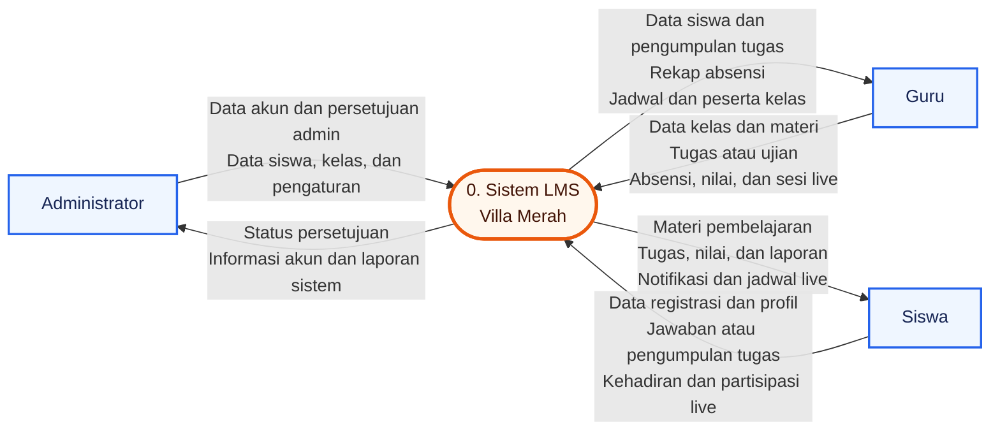

# Data Flow Diagram (DFD) Level 0 LMS Villa Merah

DFD Level 0 berikut menampilkan aplikasi sebagai satu proses utama dan
memperlihatkan pertukaran data dengan setiap entitas eksternal. Penyimpanan data
internal belum diuraikan pada level ini.

## Elemen diagram

| Kode | Jenis | Nama |
|---|---|---|
| 0 | Proses utama | Sistem LMS Villa Merah |
| A | Entitas eksternal | Administrator |
| G | Entitas eksternal | Guru |
| S | Entitas eksternal | Siswa |

## Batasan level

- Diagram hanya menunjukkan batas sistem dan arus data dengan pengguna.
- Database dan proses internal tidak ditampilkan pada DFD Level 0.
- Pemecahan proses seperti autentikasi, pengelolaan pembelajaran, penilaian,
  absensi, dan live streaming dapat dijabarkan pada DFD Level 1.

