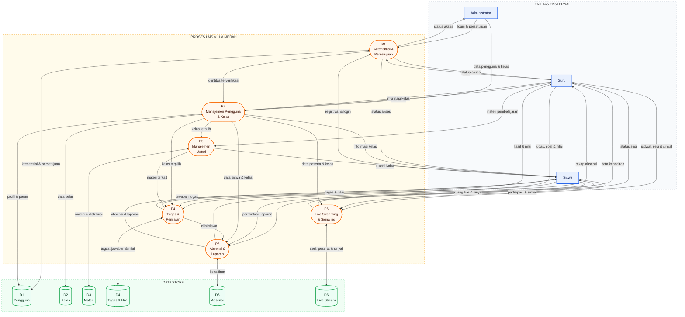

# DFD Level 1 — LMS Villa Merah

## Pemetaan data store

| Data store | Tabel aplikasi |
|---|---|
| D1 Pengguna | `users` |
| D2 Kelas | `classrooms` |
| D3 Materi | `materials`, `classroom_material` |
| D4 Tugas dan Nilai | `tasks`, `classroom_task`, `submissions` |
| D5 Absensi | `attendances` |
| D6 Live Stream | `live_stream_sessions`, `live_stream_participants`, `live_stream_signals` |
