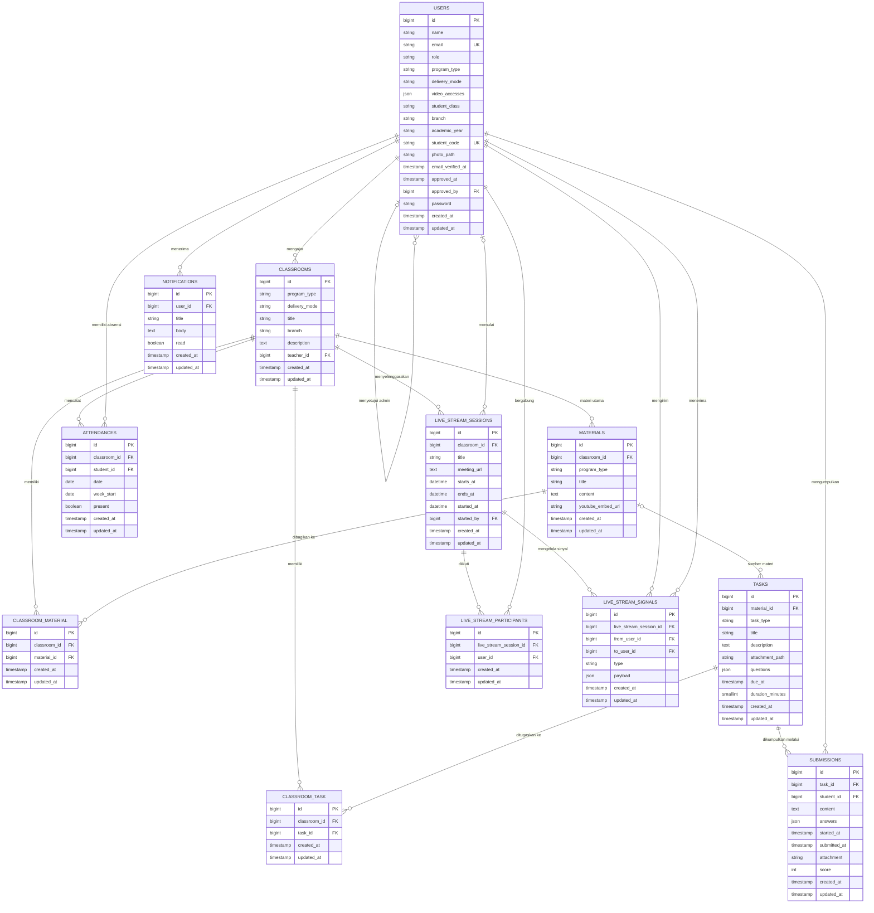

# Entity Relationship Diagram (ERD) LMS Villa Merah

Diagram ini merepresentasikan tabel bisnis pada migration aplikasi hingga
`2026_07_18_000002_create_native_live_stream_signals.php`. Tabel infrastruktur
Laravel seperti `cache`, `jobs`, `sessions`, dan `password_reset_tokens` tidak
ditampilkan agar diagram tetap fokus pada domain LMS.

## Catatan relasi

- `classroom_material` dan `classroom_task` adalah tabel pivot dengan pasangan
  foreign key yang unik.
- `materials.classroom_id` tetap menjadi relasi kelas utama, sedangkan
  `classroom_material` memungkinkan satu materi dibagikan ke beberapa kelas.
- `tasks.material_id` bersifat opsional; tugas dapat didistribusikan langsung ke
  kelas melalui `classroom_task`.
- `users.approved_by` dan `live_stream_sessions.started_by` dapat bernilai
  `NULL`.
- `attendances` memiliki kombinasi unik `student_id` dan `week_start`.

