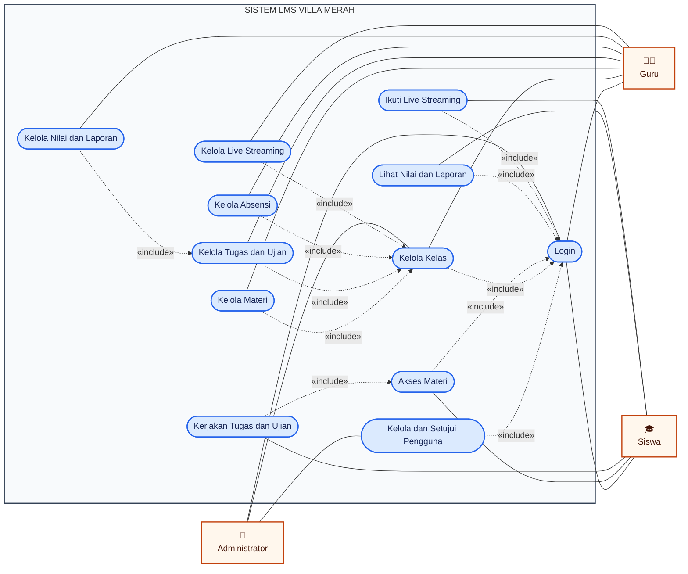

# Use Case Diagram — LMS Villa Merah

Use case diagram berikut menggambarkan fungsi LMS dari sudut pandang
Administrator, Guru, dan Siswa.

## Ringkasan aktor

| Aktor | Hak akses utama |
|---|---|
| Administrator | Login, persetujuan pengguna, pengelolaan pengguna, dan kelas |
| Guru | Kelas, materi, tugas, ujian, absensi, nilai, laporan, dan live streaming |
| Siswa | Materi, tugas atau ujian, nilai, laporan, dan live streaming |

## Keterangan relasi

- Garis penuh menunjukkan interaksi aktor dengan use case.
- Relasi `«include»` menunjukkan bahwa suatu use case selalu menggunakan fungsi
  lain sebagai bagian dari prosesnya.
- Seluruh use case berada di dalam batas **Sistem LMS Villa Merah**.

